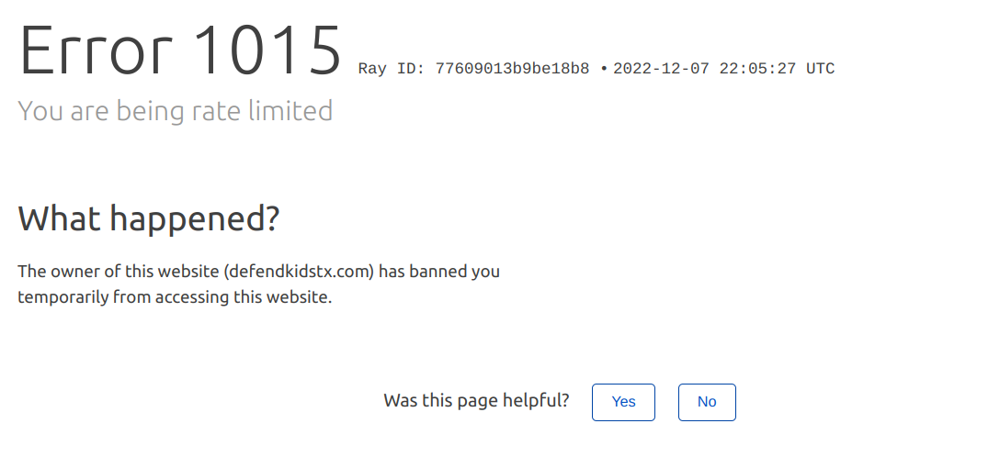

# PROTECT TRANS PEOPLE

This is a quick and dirty little scraper to automatically fill out the form on defendkidstx.com and hopefully make Texas’ life a little harder when it comes to harassing trans people. It will run indefinitely, although it will occasionally require you to fill out a captcha to submit the form.

## Running the scraper
1. Make sure you have [python installed](https://realpython.com/installing-python/)

2. Clone the repository and `cd defend_kids`

3. pip install -r requirements.txt` to install all the requirements.

4. In the `.env` file, change “CHROME_VERSION” to whatever version of chrome you’re running- this should be in Chrome > Settings > About Chrome.

5. enter `python autofill.py` in the command line to start filling out the site. 

### Important: you *may* need to fill out a CAPTCHA to submit the form. If this happens, go ahead and fill it out and MAKE SURE TO HIT THE “SUBMIT” button.

The scraper should automatically wait until you’ve done so, and alert you in the terminal.

They’re using cloudflare to prevent DDoS attacks, so if it pops up saying you’re rate limited, just wait a bit. The scraper will automatically reload and eventually you it should be able to access the page.

Right now it just fills out the “info” box on the form with a markov-chain generated text from moby dick, but you’re welcome to put your corpus of choice into “corpus.txt”

##  Contributing

They’re doing some mildly clever stuff to try and get around automating this process, and it’ll probably change as it goes along. Please, for the love of god, feel free to fork or make pull requests to update this or make it run on Windows.
